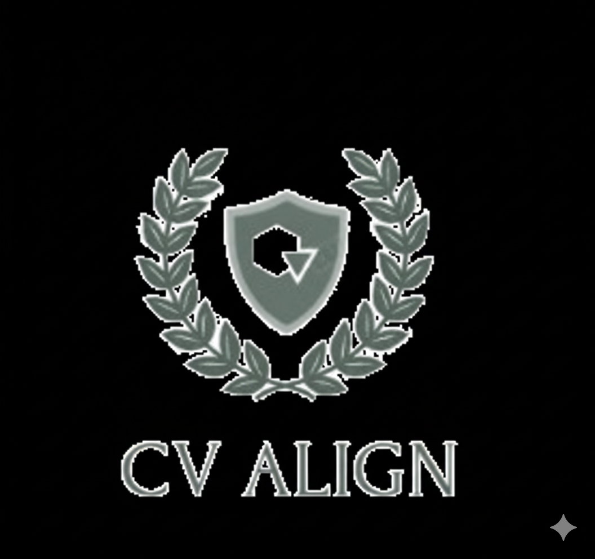

git clone https://github.com/ashokmaster83/CV_Align-app.git
cd CV_align


<div align="center">
    
    <h1>CVAlign</h1>
    <h3>AI-Powered Resume & Job Hunting Platform</h3>
    <p><em>Smarter hiring, fairer opportunities.</em></p>
    <a href="https://drive.google.com/file/d/1Ch4hcZrrRDFnnnrnmW9cDGN8hrMej75e/view?usp=sharing" target="_blank">
        
    </a>
    <br/>
    <a href="https://drive.google.com/file/d/1Ch4hcZrrRDFnnnrnmW9cDGN8hrMej75e/view?usp=sharing" target="_blank"><b>▶ Watch Demo Video</b></a>
</div>

---

## Overview

CVAlign is a full-stack platform for job hunting, intelligent resume evaluation and candidate ranking. It leverages Retrieval-Augmented Generation (RAG), Knowledge Graphs, and Large Language Models (LLMs, via Ollama/LLaMA) to deliver recruiter-grade analysis, match scores, and actionable feedback for both job seekers and employers.

---

## Features

**For Job Seekers:**
- Upload resumes (PDF, JPG)
- Get AI-powered skill extraction and resume-job matching
- Receive detailed feedback and recommendations
- Secure authentication and personal dashboard

**For Employers:**
- Submit job descriptions
- View and manage candidate applications
- AI-powered skill/entity matching
- Rank all applicants for a job with one click
- Employer dashboard for job and candidate management

**General:**
- Knowledge Graph-based skill comparison
- RAG context building for LLM analysis
- LLM-generated feedback (Ollama integration)
- Modern, responsive UI

---

## Architecture

- **Frontend:** React (Vite), TailwindCSS, ShadCN UI
- **Backend:** Node.js/Express, Python FastAPI microservice (RAG, KG, LLM)
- **AI/LLM:** Ollama (custom LLaMA model), Unsloth, FAISS, Sentence Transformers
- **Database:** MongoDB (jobs, users, applications)
- **Storage:** Cloudinary (resume files)
- **Other:** FAISS, NetworkX, dotenv

---

## ⚙️ Setup & Installation

### 1. Clone the Repository
```bash
git clone https://github.com/ashokmaster83/CV_Align-app.git
cd CV_Align
```

### 2. Backend Setup
#### Node.js & Python (FastAPI)
```bash
cd backend
python -m venv env
# Windows:
.\env\Scripts\activate
# Linux/Mac:
source env/bin/activate
pip install -r requirements.txt
uvicorn kg_rag_service.main:app --reload
# Start Node.js backend
npm install
npm start
```

### 3. Frontend Setup
```bash
cd ../Frontend
npm install
npm run dev
```

### 4. Ollama Model Setup
- Upload your custom LLaMA model (e.g., `unsloth.Q4_K_M.gguf`) to your Ollama server.
- Ensure the model name in backend config matches your Ollama model.

---

## Usage

### For Job Seekers
1. Register/login as a Job Seeker.
2. Upload your resume and apply for jobs.
3. Click "Evaluate CV" to get AI-powered feedback on your resume-job fit.

### For Employers
1. Register/login as an Employer.
2. Post job descriptions and view applications.
3. Click "Rank CV" to rank all applicants for a job using AI.

---

## Project Structure

```text
+---backend
|   +---config
|   +---controllers
|   +---cv_align
|   |   \---__pycache__
|   +---database
|   +---kg_rag_service
|   |   \---__pycache__
|   +---middlewares
|   +---models
|   +---resume_model
|   +---routes
|   +---utils
|   \---__pycache__
\---Frontend
    +---public
    |   \---CVs
    \---src
        \---components
            +---Application
            +---Auth
            +---Home
            +---Job
            +---Layout
            \---NotFound
```
## Credits & License

- Powered by Ollama, Unsloth, FAISS, NetworkX, Cloudinary, and more

---

## License

This project is licensed under the MIT License.

